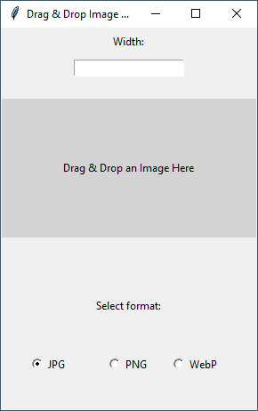

Python drag-and-drop interface to resize images, maintain aspect ratio, and save as JPG/PNG/WebP as desired.

### Required modules:
- tkinter
- tkinterdnd2
- Pillow
## How to use:
- Open the pyw file
- Insert a desired image width
- Drag & drop the image in the inteface
- The new file will be saved in the same directory from which the file was dragged.
